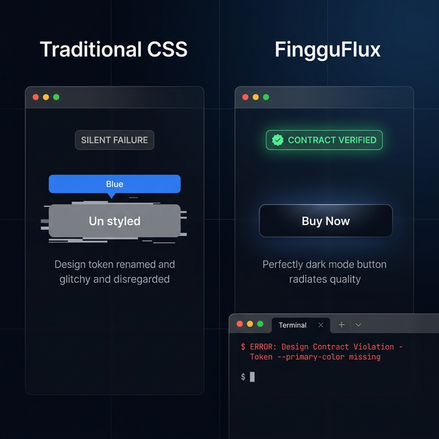
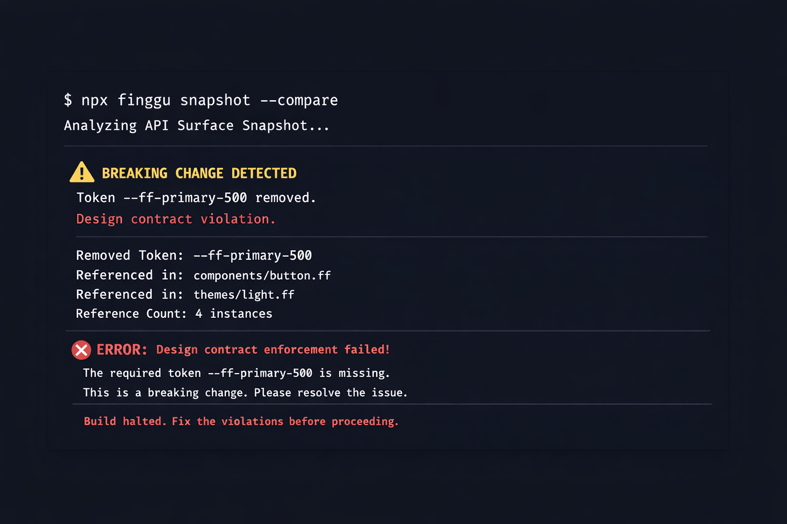

# FingguFlux

### The Transparent UI Hardening Engine

FingguFlux is a zero-runtime CSS hardening engine that prevents silent UI breakage in production.

Most CSS frameworks fail silently.
FingguFlux fails loudly — before your users ever see the bug.
Designed for long-lived production systems, design systems, and enterprise-scale frontends.

[](https://opensource.org/licenses/MIT)
[](https://www.npmjs.com/package/@finggujadhav/core)

---

## 🚀 Why FingguFlux?

- **Zero-Runtime Overhead**: No CSS-in-JS injection. Pure, static CSS.
- **Extreme Hardening**: Deterministic hashing of selectors (e.g., `.ff-btn` → `.ff-a1`) for security and minification.
- **Architectural Parity**: Identical behavior and hardening across **React**, **Vue**, and **Svelte**.
- **Token Isolation**: Nested themes ("Token Tunnels") that prevent style bleeding.
- **Motion Orchestration**: Performance-optimized, accessible motion tokens.

## 🔥 The CSS Drift Problem

### 🎥 Live Comparison — Silent Drift vs. Contract Enforcement



Traditional CSS frameworks allow **silent style drift**. When a design token is renamed or removed, production styles break without any CLI warnings or build failures. FingguFlux transforms CSS from a "trust-based" system into a **"contract-based"** one.

| Feature | Traditional CSS | FingguFlux |
| :--- | :--- | :--- |
| **Token Renaming** | Silent UI breakage | **CLI Error (Contract Violation)** |
| **Impact Detection** | Manual QA | **Automated Snapshots** |
| **Theme Integrity** | Hard to maintain | **Verified by Design Contract** |

## 🏢 Why This Matters at Scale

CSS Drift becomes dangerous when:

- Large teams modify tokens weekly
- Multiple themes exist (light/dark/system)
- Design systems live for years
- Component libraries are shared across apps

Without enforcement → silent breakage.
With FingguFlux → build-time contract validation.

### Real CLI Detection Output

When a token is removed or renamed, FingguFlux does not fail silently.

Instead, the build stops immediately and reports the violation:



> Most CSS frameworks fail silently. FingguFlux fails loudly — before production.


> [!IMPORTANT]
> FingguFlux enforces a "Design Contract". If a component expects a token that no longer exists in your theme, the build **fails** immediately, preventing broken UI from reaching your users.

### 🔴 Silent Breakage Example
In traditional CSS, renaming `--primary-color` to `--brand-color` leaves your buttons invisible or unstyled because the CSS class still points to the old variable.

### 🟢 Contract Enforcement
With FingguFlux, running `finggu snapshot --compare` detects that `ff-btn-primary` is referencing a missing token and blocks the deployment.

---

## 🧱 Core Philosophy

FingguFlux enforces three hard rules:

1. Tokens are contracts.
2. State is attribute-driven.
3. CSS must be deterministic.

No silent overrides.
No implicit dependencies.
No runtime patching.


## ❌ When Not To Use FingguFlux

FingguFlux may not be necessary if:

- You are building a small static website.
- You do not use design tokens.
- You do not require strict contract enforcement.

FingguFlux is built for long-lived, production-grade systems.


## 📦 Quick Start (2 Minutes)

### 1. Install
```bash
npm install @finggujadhav/core @finggujadhav/react
```

### 2. Configure Compiler (Vite)
```typescript
import { fingguCompiler } from '@finggu/compiler';

export default {
  plugins: [fingguCompiler({ mode: 'opt' })]
}
```

### 3. Usage
```tsx
import { Button, FingguProvider } from '@finggu/react';
import mapping from './finggu-mapping.json';

export default function App() {
  return (
    <FingguProvider mapping={mapping} mode="opt">
      <Button variant="primary" motion="pop">Hardened UI</Button>
    </FingguProvider>
  );
}
```

## 🕹️ Try it Locally

Explore the interactive **CSS Drift Demo** to see FingguFlux in action:

1. Open `docs/css-drift-demo.html` in your browser.
2. Click **"REDUCE TO CHAOS"** to witness silent breakage vs. contract enforcement.
3. Run the following commands in your terminal to see the CLI in action (requires local build):
   ```bash
   # Create a baseline of your current design tokens
   npx finggu snapshot

   # Compare changes and detect drift
   npx finggu snapshot --compare

   # Audit your theme for unused or missing tokens
   npx finggu theme-check
   ```

## 🏗️ Production-Grade Architecture

FingguFlux is structured as a modular CSS framework designed for high performance and scalability.

### Folder Structure
- `src/`: Source files organized by responsibility.
  - `base/`: Foundation styles (reset, typography, layout).
  - `tokens/`: Design tokens (CSS variables).
  - `components/`: Modular CSS components.
  - `utilities/`: Tree-shakable utility classes.
- `dist/`: Compiled and minified production artifacts.
- `docs/`: Framework documentation and API surfaces.
- `examples/`: Guided implementation examples.
- `scripts/`: Build and development automation.

### Build Pipeline
We use **PostCSS** with **Autoprefixer** and **cssnano** to ensure cross-browser compatibility and minimum file size.

```bash
# Build production CSS
npm run build

# Development mode (watch)
npm run watch
```

### Tree-Shakable Utility System
The framework's `src/index.css` is an aggregation of modular imports. For custom builds, you can import individual modules from `src/` to your own PostCSS pipeline to eliminate unused CSS automatically.

### CLI Support
The framework is CLI-ready. Use `npm run compile` to trigger the FingguFlux compiler with advanced tree-shaking and deterministic hashing (Extreme Mode).

## 🧱 Project Structure

- `src/`: Unified source of truth for tokens, CSS foundation, and modular components.
- `dist/`: Built production artifacts.
- `packages/compiler`: The build-time engine for tree-shaking and hashing.
- `packages/adapters`: Framework integrations (React, Vue, Svelte).
- `packages/js-helper`: Shared runtime logic for themes and motion.

## ⚖️ License

Distributed under the MIT License. See `LICENSE` for more information.

---

If FingguFlux helps you ship safer UI, consider ⭐ starring the repository to support the project.
Built with 🧠 by the Finggu Infotech Team.
